# Redshift DDM Architecture Diagram

```mermaid
graph TB
    subgraph Users["👥 User Roles"]
        Admin["🔑 Admin Role<br/>(Full Access)"]
        Analyst["📊 Analyst Role<br/>(Partial Masking)"]
        Regular["👤 Regular Role<br/>(Full Masking)"]
    end

    subgraph Policies["🛡️ Masking Policies"]
        SHA2["SHA2 Hash<br/>SHA2-256"]
        Redact["Full Redaction<br/>*REDACTED*"]
        DateMask["Date Masking<br/>1900-01-01"]
        NumMask["Numeric Masking<br/>999"]
        ZipMask["ZIP Partial Mask<br/>XXXXX-XX00"]
    end

    subgraph Tables["📊 Redshift Tables"]
        subgraph Staging["Staging Tables"]
            XSTG["xstg_*<br/>(CSng Staging)"]
            TSTG["tstg_*<br/>(TOP Staging)"]
        end
        subgraph Analytics["Analytics Tables"]
            TFAC["tfac_*<br/>(Fact Tables)"]
            TDIM["tdim_*<br/>(Dimension Tables)"]
        end
    end

    subgraph SensitiveData["🔒 Sensitive Data Types"]
        SSN["SSN/TIN<br/>Account Numbers"]
        PII["Names, Addresses<br/>Contact Info"]
        DOB["Date of Birth"]
        IDs["Numeric IDs"]
        ZIP["ZIP Codes"]
    end

    Admin -->|No Masking| Tables
    Analyst -->|Applies| SHA2
    Analyst -->|Applies| Redact
    Regular -->|Applies| SHA2
    Regular -->|Applies| Redact
    Regular -->|Applies| DateMask
    Regular -->|Applies| NumMask
    Regular -->|Applies| ZipMask

    SHA2 -.->|Protects| SSN
    Redact -.->|Protects| PII
    DateMask -.->|Protects| DOB
    NumMask -.->|Protects| IDs
    ZipMask -.->|Protects| ZIP

    SSN -.->|Located in| Tables
    PII -.->|Located in| Tables
    DOB -.->|Located in| Tables
    IDs -.->|Located in| Tables
    ZIP -.->|Located in| Tables

    style Admin fill:#90EE90
    style Analyst fill:#FFD700
    style Regular fill:#FF6B6B
    style SHA2 fill:#4A90E2
    style Redact fill:#E24A4A
    style DateMask fill:#9B59B6
    style NumMask fill:#F39C12
    style ZipMask fill:#1ABC9C
```



## Architecture Components

### 1. User Roles (Access Levels)
- **Admin Role** (Green): Full unmasked access to all data
- **Analyst Role** (Yellow): Partial masking - can see hashed SSN/TIN but PII is redacted
- **Regular Role** (Red): Full masking - all sensitive data is masked

### 2. Masking Policies (Protection Mechanisms)
- **SHA2 Hash**: One-way SHA2-256 encryption for SSN, TIN, account numbers
- **Full Redaction**: Replaces sensitive text with `*REDACTED*`
- **Date Masking**: Replaces dates with `1900-01-01`
- **Numeric Masking**: Replaces numbers with `999`
- **ZIP Partial Mask**: Masks first 8 characters to `XXXXX-XX00`

### 3. Data Tables (Storage Layer)
- **xstg_***: CSng staging tables (arawg, arentity, arpoe, etc.)
- **tstg_***: TOP staging tables (debt, debtor, offset, payment, etc.)
- **tfac_***: Fact tables (post_match, ng_post_match)
- **tdim_***: Dimension tables

### 4. Sensitive Data Types (Protected Information)
- SSN/TIN and account numbers
- Names, addresses, contact information
- Date of birth
- Numeric identifiers
- ZIP codes

## Data Flow

1. **Admin users** query tables directly without any masking applied
2. **Analyst users** see SHA2-hashed SSN/TIN values and redacted PII
3. **Regular users** see all sensitive data fully masked across all policy types
4. Masking policies are attached at the column level with priority settings
5. Policies are enforced at query time by Redshift DDM engine

## Security Model

```
Access Level:  Admin > Analyst > Regular
Masking Level: None  < Partial < Full
```
